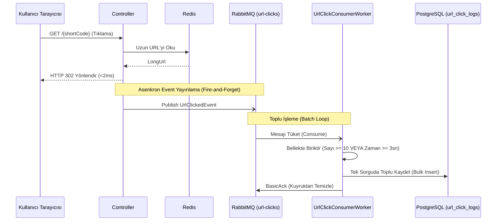

# 🏛️ Kurumsal Sistem Tasarımı ve Mimari Notları
**Proje:** Yüksek Ölçeklenebilir .NET 10 URL Kısaltıcı & Analitik Mimarisi  
**Referans:** Mimari ve Sistem Tasarımı El Kitabı  

---

## 📌 Yönetici Özeti (Executive Summary)

Bu doküman, geliştirilen URL Shortener sisteminin mimari kararlarını, teknik gerekçelerini ve büyük ölçekli (anlık 100.000+ istek/sn) yük altındaki davranışlarını belgeleyen ana sistem tasarımı rehberidir.

Sistem; **<5ms yönlendirme gecikmesi**, **çakışmasız kod üretimi**, **sıfır veritabanı tablo şişmesi (Zero MVCC Bloat)** ve **asenkron olay odaklı analitik** mimarisi sunar.

---

## 🛠️ Teknoloji Yığını ve Katmanlı Mimari (Clean Architecture)

```
url-shortener-dotnet/
├── Core/                            # Domain Nesneleri, DTO'lar, Event'ler, Interface'ler (Dış bağımlılıksız)
├── Application/                     # İş Mantığı (Use Cases) ve Servis Orkestrasyonu
├── Infrastructure/                  # Veritabanı (PostgreSQL), Önbellek (Redis), Mesajlaşma (RabbitMQ)
└── Controllers/                     # REST Endpoints ve HTTP 302 Yönlendirme Sürücüleri
```

| Bileşen | Teknoloji | Kullanım Amacı |
|---|---|---|
| **Çerçeve (Framework)** | .NET 10 Web API | Yüksek performanslı asenkron çalışma zamanı |
| **Veritabanı (DB)** | PostgreSQL 16 | URL kayıtları ve Analitik logları için ilişkisel veri deposu |
| **Önbellek (Cache)** | Redis 7 (Alpine) | RAM üzerinde çalışan Read-Through Önbellek (<2ms erişim) |
| **Mesaj Kuyruğu** | RabbitMQ 3 (Management) | Asenkron tıklama olayları için şok emici tampon (Buffer) |
| **Konteynerizasyon** | Docker & Docker Compose | Tamamen izole ve taşınabilir çoklu konteyner kümesi |

---

## 🧠 5 Temel Sistem Tasarımı Problemi ve Mimari Çözümleri

### 1. Veritabanı Okuma Tıkanması (Database Read Bottleneck)
* **Problem:** İsteklerin %99'u okuma (yönlendirme) işlemidir. Doğrudan DB'ye gitmek veritabanı bağlantı havuzunu tüketir.
* **Çözüm:** **Read-Through / Cache-Aside Önbellekleme (Redis)**. İstekler önce Redis'e (`url:{shortCode}`) sorulur. Önbellekte varsa veritabanına **hiç dokunmadan** (<2ms) yanıt dönülür.

### 2. Kısa Kod Çakışması (Short Code Collision)
* **Problem:** MD5/SHA256 gibi hash'lerin ilk 6 karakterini kesmek yüksek çakışma riski doğurur ve DB'de yavaş döngülere yol açar.
* **Çözüm:** **Auto-Increment ID + Base62 Algoritması**. PostgreSQL'in ürettiği benzersiz sayısal ID (`125`), Base62 ile (`"2d"`) metne dönüştürülür. Çakışma **matematiksel olarak imkansızdır.**

### 3. PostgreSQL MVCC ve Tablo Şişmesi Önleme (Zero Table Bloat)
* **Problem:** Her tıklamada `UPDATE shortened_urls SET click_count = click_count + 1` çalıştırmak PostgreSQL'in MVCC mekanizması sebebiyle milyarlarca ölü satır (*Dead Tuple*) oluşturur, tabloyu şişirir ve B-Tree indekslerini bozar.
* **Çözüm:** 
  1. **Ana Yönlendirme Tablosu (`shortened_urls`):** `UPDATE` yapılmaz, tamamen sabittir (Immutable).
  2. **Analitik Tablosu (`url_click_logs`):** Sadece `INSERT-ONLY` (Ekleme Odaklı) çalışır.
  3. **Canlı Tıklama Sayacı:** RAM üzerinde Redis `INCR` komutuyla atomik olarak artırılır.

### 4. Asenkron Analitik Toplama (Event-Driven Pipeline)
* **Problem:** Yönlendirme anında IP, User-Agent, Referer ve Zaman verisini senkron kaydetmek yönlendirme süresini 2ms'den 200ms'ye çıkarır.
* **Çözüm:** **RabbitMQ Asenkron Yayıncı + Arka Plan İşçi Servisi (Consumer)**. API yönlendirmeyi yapıp `HTTP 302` dönerken arka planda RabbitMQ'ya bir `UrlClickedEvent` fırlatır ("Fire-and-forget").

### 5. HTTP Yönlendirme Kodu Tercihi (301 vs 302)
* **Problem:** Yanlış statü kodu kullanımı analitik verilerinin kaybolmasına veya sunucu yüküne sebep olur.
* **Çözüm:** **HTTP 302 Found (`permanent: false`)**. Tarayıcının veriyi önbelleğe almasını engelleyerek her tıklamada sunucuya uğramasını ve analitik verisinin toplanmasını sağlar.

---

## ⚡ Asenkron Olay Odaklı Mimari ve Toplu İşleme (Batch Processing)



### Çift Flush Stratejisi (Sayı + Zaman Limiti)
- **Yoğun Trafikte:** Liste büyüklüğü **10 adete** ulaştığı an anında veritabanına yazılır.
- **Düşük Trafikte / Gece:** 10 adete ulaşılmasa bile **3 saniye** dolduğunda bellekteki veriler kaybolmadan veritabanına yazılır.

---

## 🔢 Base62 Matematiksel Kapasite Hesabı

$$\text{Kapasite} = 62^\text{Karakter Sayısı}$$

| Karakter Uzunluğu | Olası Kombinasyon Sayısı (Kapasite) |
|---|---|
| 3 Karakter | 238.328 adet link |
| 5 Karakter | 916 Milyon adet link |
| **6 Karakter** | **56.8 Milyar adet link** |
| **7 Karakter** | **3.5 Trilyon adet link** |

*Base62 kümesi `0-9`, `a-z`, `A-Z` karakterlerinden oluşur. Base64'te bulunan URL bozucu özel karakterleri (`+`, `/`, `=`) içermez.*

---

## 🧩 SOLID Prensipleri Haritası

1. **S - Single Responsibility (Tek Sorumluluk):** `Base62Encoder` sadece sayı çevirir, `RedisCacheService` sadece önbellek yönetir, `RabbitMQPublisher` sadece mesaj yayınlar.
2. **O - Open/Closed (Açık/Kapalı):** Soyutlanmış interface'ler (`ICacheService`, `IMessagePublisher`) sayesinde var olan koda dokunmadan Redis veya RabbitMQ yerine başka bir teknolojiye geçilebilir.
3. **L - Liskov Substitution (Liskov'un Yerine Geçme):** Tüm türetilmiş servisler interface'lerinin yerine sorunsuz geçebilir.
4. **I - Interface Segregation (Arayüz Ayırma):** Küçük ve odaklanmış interface'ler ([`IUrlRepository`](file:///C:/Users/melih/.gemini/antigravity-ide/scratch/url-shortener-dotnet/Core/Interfaces/IUrlRepository.cs), [`ICacheService`](file:///C:/Users/melih/.gemini/antigravity-ide/scratch/url-shortener-dotnet/Core/Interfaces/ICacheService.cs)).
5. **D - Dependency Inversion (Bağımlılıkların Tersine Çevrilmesi):** İş katmanı ([`UrlShortenerService`](file:///C:/Users/melih/.gemini/antigravity-ide/scratch/url-shortener-dotnet/Application/Services/UrlShortenerService.cs)) somut sınıflara değil soyut arabirimlere bağımlıdır.
