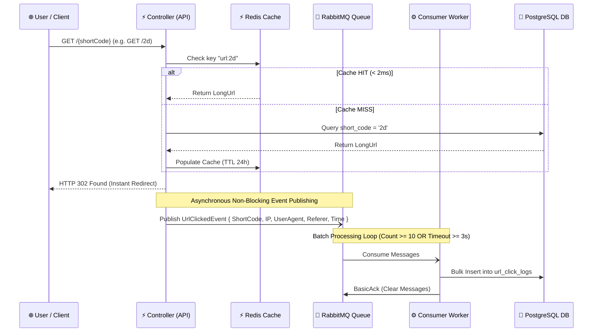

# 🚀 Analytics-Driven & Event-Driven Enterprise URL Shortener

[](https://dotnet.microsoft.com/)
[](https://www.postgresql.org/)
[](https://redis.io/)
[](https://www.rabbitmq.com/)
[](https://www.docker.com/)
[](https://blog.cleancoder.com/uncle-bob/2012/08/13/the-clean-architecture.html)

A high-throughput, enterprise-grade distributed URL Shortener API built with **.NET 10**, **Clean Architecture**, **SOLID Principles**, **Redis Read-Through Caching**, **Base62 Collision-Free Encoding**, **PostgreSQL MVCC Table Bloat Prevention**, and an **Event-Driven RabbitMQ Analytics Pipeline**.

---

## 🏛️ System Architecture

```mermaid
graph TD
    Client[🌐 User Browser / App] -->|HTTP Request| API[⚡ ASP.NET Core 10 Web API]

    subgraph Security Katmanı
        API -->|Check IP Limits| RL[🛡️ IP Rate Limiter - Fixed Window]
    end

    subgraph High-Speed Yönlendirme (Read Path < 2ms)
        API -->|1. Try Cache| Redis[(⚡ Redis 7 In-Memory Cache)]
        Redis -.->|Cache Miss| PG[(🐘 PostgreSQL 16 Main DB)]
    end

    subgraph Event-Driven Asenkron Analitik Hattı
        API -->|2. Fire-and-Forget Publish| MQ[🐇 RabbitMQ Message Queue]
        MQ -->|Consume Batch| Worker[⚙️ UrlClickConsumerWorker BackgroundService]
        Worker -->|3. Bulk Insert 1000s| Logs[(📊 PostgreSQL url_click_logs)]
    end
```

---

## ⚡ Interactive Sequence Flow



---

## 🧠 Solved System Design Problems & Architectural Highlights

| # | System Design Problem | Risk / Trade-off | Architectural Solution |
|---|---|---|---|
| **1** | **Database Read Bottleneck** | 99% of requests are reads. Direct DB queries cause Connection Pool Exhaustion. | **Redis Read-Through Cache** (< 2ms lookups, reduces DB load by >95%). |
| **2** | **Short Code Collisions** | Truncated MD5/SHA256 hashes cause collisions & costly DB retry loops. | **Auto-Increment ID + Base62 Encoding** (Mathematically guaranteed zero collisions). |
| **3** | **PostgreSQL MVCC Table Bloat** | `UPDATE click_count` creates Dead Tuples, bloating tables to GBs & fragmenting indexes. | **Immutable Main Table + Insert-Only Analytics Logs + Atomic Redis `INCR` Counters**. |
| **4** | **Redirect Latency & Telemetry** | Extracting IP, Geo, & User-Agent synchronously delays redirects from 2ms to 200ms. | **RabbitMQ Asynchronous Publishing + Background Batch Consumer Worker**. |
| **5** | **Bot & DDOS Abuse** | Bots flooding `POST /shorten` fill storage with spam URLs. | **IP-Based ASP.NET Core Rate Limiting** (`HTTP 429 Too Many Requests`). |
| **6** | **HTTP Redirect Code Choice** | 301 vs 302 mismatch causes lost metrics or server overload. | **HTTP 302 Found (`permanent: false`)** to capture telemetry on every click. |

---

## 🔢 Base62 Encoding Math vs Base64

Base62 uses `0-9`, `a-z`, `A-Z` (62 URL-safe characters), eliminating URL-breaking special characters (`+`, `/`, `=`) found in Base64.

$$\text{Capacity} = 62^\text{Length}$$

| Character Length | Unique Combination Capacity |
|---|---|
| 3 Characters | 238,328 |
| 5 Characters | 916,132,832 (~916 Million) |
| **6 Characters** | **56,800,235,584 (~56.8 Billion)** |
| **7 Characters** | **3,521,614,606,208 (~3.5 Trillion)** |

---

## 🛠️ Getting Started (Docker Compose)

### Prerequisites
- [Docker Desktop](https://www.docker.com/products/docker-desktop/) installed.

### 1. Clone & Spin Up
```bash
git clone https://github.com/melihesensio99/Analytics-Driven-URL-Shortener.git
cd Analytics-Driven-URL-Shortener
docker compose up --build -d
```

### 2. Available Services
- 🌐 **REST API & Redirect Service:** `http://localhost:5000`
- 📑 **Interactive Swagger UI:** `http://localhost:5000/swagger`
- 🐇 **RabbitMQ Management Dashboard:** `http://localhost:15672` *(User: `guest`, Pass: `guest`)*
- 🐘 **PostgreSQL Database:** `localhost:5432`
- ⚡ **Redis Cache:** `localhost:6379`

---

## 📑 API Reference

### 1. Shorten URL
`POST /api/urlshortener/shorten`

**Request:**
```json
{
  "url": "https://github.com/donnemartin/system-design-primer"
}
```

**Response (HTTP 200 OK):**
```json
{
  "shortCode": "1",
  "shortUrl": "http://localhost:5000/1",
  "longUrl": "https://github.com/donnemartin/system-design-primer",
  "createdAt": "2026-09-26T20:00:00Z"
}
```

### 2. Redirect Short URL
`GET /{shortCode}` $\rightarrow$ **HTTP 302 Temporary Redirect**

### 3. Get URL Analytics
`GET /api/urlshortener/analytics/{shortCode}`

**Response (HTTP 200 OK):**
```json
{
  "shortCode": "1",
  "longUrl": "https://github.com/donnemartin/system-design-primer",
  "createdAt": "2026-09-26T20:00:00Z",
  "totalClicks": 125,
  "dbClicks": 100,
  "cachedClicks": 25
}
```

---

## 🧩 SOLID & Clean Architecture Mapping

- **Single Responsibility Principle (SRP):** `Base62Encoder` handles numeric encoding only; `RedisCacheService` manages Redis keys only; `RabbitMQPublisher` publishes events only.
- **Open/Closed Principle (OCP):** Interface abstractions (`ICacheService`, `IMessagePublisher`) allow replacing Redis or RabbitMQ without touching core domain or application logic.
- **Liskov Substitution Principle (LSP):** Concrete infrastructure implementations fulfill interface contracts seamlessly.
- **Interface Segregation Principle (ISP):** Small, focused interfaces (`IUrlRepository`, `ICacheService`, `IBase62Encoder`).
- **Dependency Inversion Principle (DIP):** High-level application service (`UrlShortenerService`) depends strictly on abstractions (`ICacheService`, `IUrlRepository`), not concrete low-level drivers.

---

## 📝 License
This project is open-source under the MIT License.
